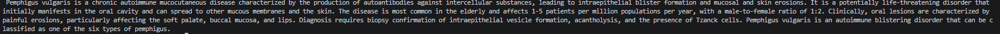
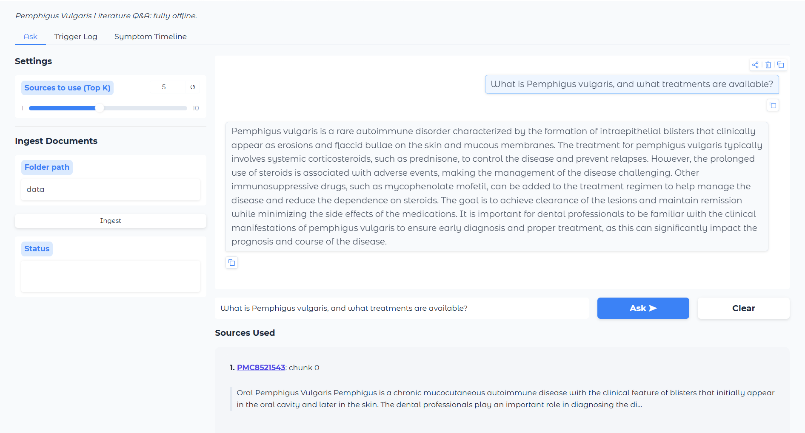
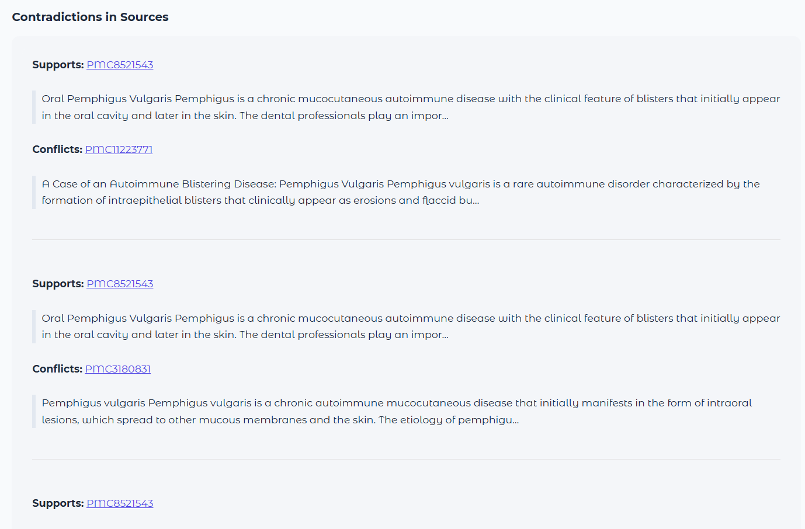
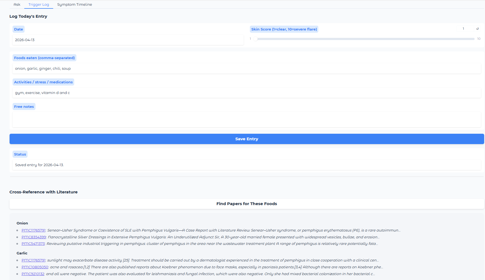
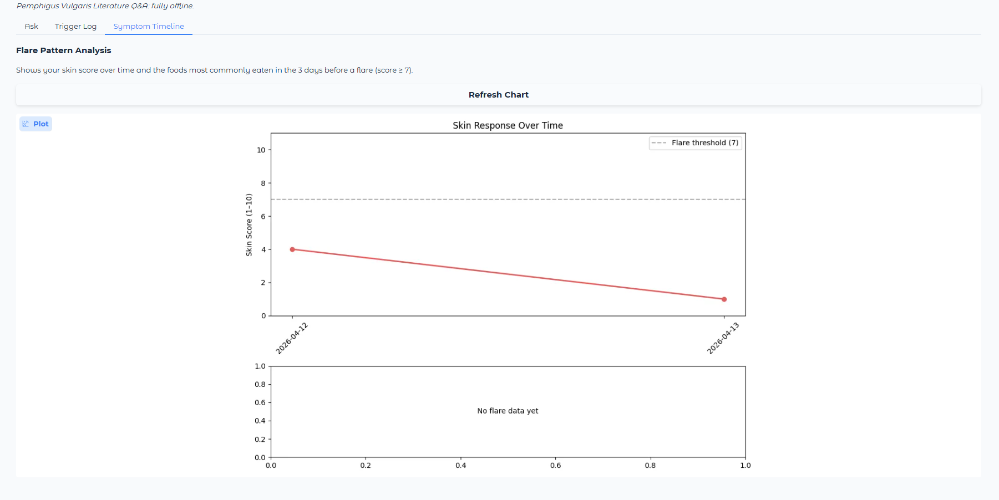

# PV-RAG: Pemphigus Vulgaris Literature Q&A

- A fully **free, local, offline Retrieval-Augmented Generation (RAG) pipeline** for pemphigus vulgaris.
- Automatically fetches research from **PubMed** (abstracts) and **PubMed Central** (full text) via the NCBI API.
- Built with **Python**, **FAISS**, and **BGE embeddings**, optimized for CPU and small laptops.

## For Patients and Healthcare Professionals

- Pemphigus vulgaris is a rare autoimmune blistering disease. Keeping up with the research is hard.
- There are thousands of published studies, and most patients never see them. This tool changes that.

**What it does:**

- It downloads the full library of pemphigus vulgaris research from PubMed and PubMed Central, stores it locally on your computer, and lets you ask questions about it in plain English.
- You type a question. It searches the studies, finds the most relevant ones, and writes an answer using only what those papers actually say. 
- Every answer is linked back to its source so you can read the original paper yourself.

- No internet connection is needed after the initial setup. Nothing is sent to a cloud service.
- Your questions stay on your machine.

**The patient tracking features:**

- Beyond answering questions, the tool includes a personal health log. 
- Each day, you can record what you ate, your activity level, any stress, and how your skin responded on a scale of 1 to 10.
- Over time, the tool builds a chart of your skin score history and identifies which foods appearedmost often in the days before a flare. 
- It also cross-references your food log against the medical literature, so if you log that you ate a particular food, the tool will show you whether any published studies have linked that food to pemphigus activity.

**What it is not:**

- This is not a diagnostic tool and it does not replace your dermatologist. It is a research assistant and a personal log. 
- It helps you come to appointments better prepared, notice patterns in your own data, and understand what the published literature says about your condition.

**Who built it and why:**

 **Built by Prakhar Rampalli**: [linkedin.com/in/prakhar-rampalli](https://linkedin.com/in/prakhar-rampalli)
- This project was built to make specialist-level medical literature accessible to the people who need it most, at no cost and with no ongoing subscription.

*Ingesting PubMed abstracts via CLI*


*Plain-English question answered with source links*


*Contradiction flags when retrieved papers disagree*


*Daily health log with food-to-literature cross-reference*


*Flare correlation chart: foods appearing before flares*


---

## For Engineers

## Features

- Automated literature fetching from **PubMed** (abstracts) and **PMC Open Access** (full text) via NCBI Entrez API
- Ingest local documents (`.txt`, `.md`, `.pdf`, `.docx`) alongside downloaded literature
- Paragraph-aware **chunking with overlap** for better retrieval
- Semantic search using **FAISS** (auto-selects flat or IVFPQ based on dataset size)
- **Cross-encoder reranking** for improved relevance
- **Contradiction detector** that surfaces conflicting claims across retrieved sources
- Ask questions using a **local LLM** (Mistral 7B Instruct GGUF): no API keys
- **Streaming Gradio UI** with three tabs: Q&A, Trigger Log, Symptom Timeline
- **Personal health log** stored in local SQLite: foods, activities, skin score per day
- **Food-to-literature cross-reference**: links your logged foods to relevant PV papers
- **Symptom timeline** with pre-flare correlation chart
- CLI interface for power users
- 100% offline after initial fetch and model download
---

## Why Not Just Use LangChain or LlamaIndex?

- LangChain and LlamaIndex are excellent frameworks, but they hide the details: you chain components together without necessarily understanding what each one does.
- This project was built from scratch deliberately: each component (chunking, embedding, FAISS indexing, reranking, prompt construction) is implemented individually so the full pipeline is transparent and debuggable.
- There are no hidden defaults, no black-box retrieval methods, and no framework doing things behind the scenes. Everything is clear. If something goes wrong, you can trace the exact step in the pipeline where it failed.

## Project Structure

```
pv-rag/
├── app.py              # Gradio web UI (3 tabs: Ask, Trigger Log, Symptom Timeline)
├── main.py             # CLI interface: ingest, search, ask
├── fetch_data.py       # NCBI literature fetcher CLI
├── config.py           # Configuration: chunk size, model names, top-k, NCBI settings
├── embed.py            # BGE embedding utilities
├── ingest.py           # Document ingestion + FAISS indexing
├── search.py           # Semantic search over FAISS index
├── rerank.py           # Cross-encoder reranking
├── rag.py              # RAG pipeline: search + rerank + LLM
├── llm.py              # LLM generation (Mistral 7B via llama-cpp-python)
├── contradiction.py    # Detects conflicting claims across retrieved chunks
├── fetchers/
│   ├── __init__.py
│   ├── pubmed.py       # PubMed abstract fetcher (NCBI Entrez)
│   └── pmc.py          # PMC full-text fetcher (Open Access subset)
├── patient/
│   ├── __init__.py
│   ├── db.py           # SQLite schema and connection
│   ├── tracker.py      # Daily log CRUD + food-to-literature cross-reference
│   └── timeline.py     # Flare pattern analysis + matplotlib chart
├── utils/
│   ├── __init__.py
│   ├── chunking.py     # Paragraph-aware chunking with overlap
│   └── text_clean.py   # Text normalization
├── loaders/
│   ├── __init__.py
│   ├── base.py
│   ├── text_loader.py  # .txt with encoding fallback
│   ├── markdown_loader.py
│   ├── pdf_loader.py
│   └── docx_loader.py  # Extracts paragraphs + tables
├── models/             # Place your GGUF model here
├── data/
│   ├── pubmed/         # Downloaded PubMed abstracts (auto-created by fetch_data.py)
│   ├── pmc/            # Downloaded PMC full texts (auto-created by fetch_data.py)
│   └── patient.db      # SQLite health log (auto-created on first log entry)
├── index/              # FAISS index + metadata (auto-created on ingest)
└── requirements.txt
```

---

## Requirements

- **Python 3.11** (3.13 has compatibility issues with several dependencies)
- Windows / Linux / macOS
- ~8GB RAM minimum (16GB recommended for comfortable use)
- Internet connection for the initial literature fetch only

---

## Installation

### 1. Clone the repo

```bash
git clone https://github.com/rampalliprakhar/PV-RAG.git
cd pv-rag
```

### 2. Create Python 3.11 virtual environment

```bash
py -3.11 -m venv .venv
.venv\Scripts\activate        # Windows
source .venv/bin/activate     # Linux/macOS
```

Verify:
```bash
python --version   # Should print Python 3.11.x
```

- Windows note: Use `python` after activating the venv, not `py`. 
- The `py` launcher always points to the system default Python, not the venv.

### 3. Install llama-cpp-python (pre-built binary)

`llama-cpp-python` is a C++ extension. Use the pre-built CPU wheel to avoid needing a compiler:

```bash
pip install llama-cpp-python --prefer-binary --extra-index-url https://abetlen.github.io/llama-cpp-python/whl/cpu
```

### 4. Install remaining dependencies

```bash
pip install -r requirements.txt
```

### 5. Download the LLM model

Download a GGUF model and place it in the `models/` folder.

**Recommended**: Mistral 7B Instruct v0.2 Q4_K_M

Expected path:
```
models/mistral-7b-instruct-v0.2.Q4_K_M.gguf
```

If your filename differs, update `model_path` in `llm.py`.

---

## Usage

### Step 1: Fetch PV literature from NCBI (one time, internet required)

```bash
set NCBI_EMAIL=you@example.com        # Windows
# export NCBI_EMAIL=you@example.com   # Linux/macOS

python fetch_data.py                  # fetch both PubMed and PMC
python fetch_data.py --pubmed         # abstracts only (~12,000 papers)
python fetch_data.py --pmc            # full text only (~3,000 OA papers)
```

- This saves files to `data/pubmed/` and `data/pmc/`. 
- Re-run periodically to pull new publications. Already-downloaded files are skipped automatically.

### Step 2: Build the search index

```bash
python main.py ingest data/
```

- Walks through all files in `data/` recursively
- Extracts text from `.txt`, `.md`, `.pdf`, `.docx`
- Performs smart chunking with overlap
- Embeds text with BGE-small
- Builds FAISS index (flat for small sets, IVFPQ for large ones)
- Saves index and metadata to `index/`

### Step 3: Use the app (fully offline from here)

#### Option A: Gradio Web UI

```bash
python app.py
```

Opens at http://127.0.0.1:7860 with three tabs:

- **Ask the Literature**: type a question, get a streamed answer with source links and contradiction detection
- **Trigger Log**: log daily foods, activities, skin score; cross-reference foods against literature
- **Symptom Timeline**: chart of skin scores over time and foods most common before flares

- The Top K slider controls how many source chunks are used per answer.

#### Option B: CLI

```bash
# Search for relevant chunks
python main.py search "rituximab pemphigus vulgaris"

# Ask a question
python main.py ask "What are the indications for rituximab in pemphigus vulgaris?"
```

---

## Configuration

Edit `config.py` to adjust:

```python
CHUNK_SIZE = 400                        # words per chunk
CHUNK_OVERLAP = 80                      # overlap between chunks
TOP_K_RETRIEVE = 50                     # candidate chunks to fetch from FAISS
TOP_K_FINAL = 5                         # top chunks after rerank
EMBED_MODEL = "BAAI/bge-small-en-v1.5"
RERANK_MODEL = "cross-encoder/ms-marco-MiniLM-L-6-v2"

NCBI_EMAIL = "your-email@example.com"  # required by NCBI policy
NCBI_API_KEY = ""                       # optional: raises rate limit from 3 to 10 req/s
PV_QUERY = "pemphigus vulgaris"
PUBMED_MAX_RESULTS = 10000
PMC_MAX_RESULTS = 3000
PUBMED_DATA_FOLDER = "data/pubmed"
PMC_DATA_FOLDER = "data/pmc"
```

- A free NCBI API key can be obtained at https://www.ncbi.nlm.nih.gov/account/ and roughly triples fetch speed.

---

## Supported File Types

| Format | Library       | Notes                                         |
|--------|---------------|-----------------------------------------------|
| .txt   | built-in      | Cleaned whitespace                            |
| .md    | markdown + bs4| Strips formatting                             |
| .pdf   | pdfplumber    | Handles paragraphs, removes headers/footers   |
| .docx  | python-docx   | Extracts paragraphs and tables                |

- All libraries are free and local: no APIs needed for ingestion.

---

## Performance Notes

- First run is slow: the LLM (~4GB) is loaded into RAM once and cached for the session. Subsequent questions are faster.
- Generation speed: ~5-10 tokens/second on CPU
- Reduce `TOP_K_FINAL` to 3 in `config.py` for faster answers
- Reduce `batch_size` in `embed.py` if RAM is limited during ingestion
- FAISS automatically uses a flat index for small datasets (<3,900 chunks) and IVFPQ for large ones
- Fetching without an API key takes 30-60 minutes; with a key, around 10-15 minutes

## Hardware Notes

- Tested on HP Envy x360, 16GB RAM
- Works fully offline after initial fetch and model download
- BGE-small embedding model: ~130MB
- Mistral 7B Q4_K_M: ~4GB RAM
- Full PV literature index (pubmed + pmc): ~1-2GB disk

## License

[](LICENSE)

## Tips and Best Practices

- Run `python fetch_data.py` every few months to pull newly published papers
- Set `NCBI_API_KEY` in `config.py` for significantly faster fetching
- Increase `FLARE_THRESHOLD` in `patient/timeline.py` if you want to track moderate flares (default is 7)
- Reranker improves relevance but increases CPU usage; reduce `TOP_K_RETRIEVE` if it is slow
- LLM answer quality depends on context length and chunking; longer chunks give more context but use more RAM
